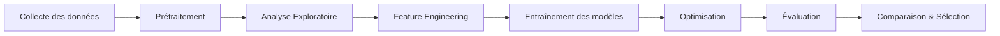

# 🩺 Diabetes Prediction Project

<div align="center">


**Un système complet de prédiction du diabète basé sur le Machine Learning**

[Installation](#-installation) • [Utilisation](#-utilisation) • [Résultats](#-résultats) • [Documentation](#-documentation)

</div>

---

## 📋 Table des matières

- [📖 Vue d'ensemble](#-vue-densemble)
- [✨ Fonctionnalités](#-fonctionnalités)
- [🛠️ Technologies utilisées](#️-technologies-utilisées)
- [📊 Dataset](#-dataset)
- [🔬 Méthodologie](#-méthodologie)
- [📁 Structure du projet](#-structure-du-projet)
- [⚙️ Installation](#️-installation)
- [🚀 Utilisation](#-utilisation)
- [📈 Résultats](#-résultats)
- [🎯 Hyperparamètres optimaux](#-hyperparamètres-optimaux)
- [📚 Documentation des modules](#-documentation-des-modules)
- [🎓 Valeur éducative](#-valeur-éducative)
- [🗺️ Roadmap](#️-roadmap)
- [🤝 Contribution](#-contribution)
- [📄 Licence](#-licence)
- [👨‍🎓 Auteur](#-auteur)
- [📖 Citation](#-citation)

---

## 📖 Vue d'ensemble

Ce projet a été développé dans le cadre de mon **Projet de Fin d'Études** en **Licence** en **Génie Logiciel**. Il propose une solution complète de prédiction du risque de diabète en s'appuyant sur des mesures cliniques.

Après une expérimentation approfondie de plusieurs algorithmes, les modèles **KNN (K-Nearest Neighbors)** et **Random Forest** ont été identifiés comme les plus performants, atteignant une **précision de 83%** et un **F1-Score de 0.84** sur la classe positive (diabète).

> 💡 **Objectif principal** : Fournir un outil d'aide à la décision médicale fiable, reproductible et facilement déployable.

---

## ✨ Fonctionnalités

| Catégorie | Description |
| :--- | :--- |
| 🔍 **EDA** | Analyse exploratoire complète (corrélations, distributions, valeurs manquantes) |
| 🤖 **Multi-modèles** | KNN, Random Forest, Decision Tree, SVM, Logistic Regression |
| ⚙️ **Optimisation** | Recherche d'hyperparamètres via GridSearchCV / RandomizedSearchCV |
| 📊 **Évaluation** | Accuracy, Precision, Recall, F1-Score, ROC-AUC, Matrice de confusion |
| 🎨 **Visualisation** | Courbes ROC, matrices de confusion, graphiques comparatifs |
| 📦 **Architecture** | Structure professionnelle en package Python modulaire |

---

## 🛠️ Technologies utilisées

<div align="center">

| Langage | Bibliothèques | Outils |
| :---: | :---: | :---: |
|  | NumPy · Pandas · Scikit-learn · Matplotlib · Seaborn | Jupyter · Git · VS Code |

</div>

**Dépendances principales :**
- `pandas` ≥ 1.5.0 — Manipulation de données
- `numpy` ≥ 1.23.0 — Calcul numérique
- `scikit-learn` ≥ 1.2.0 — Machine Learning
- `matplotlib` ≥ 3.6.0 — Visualisation
- `seaborn` ≥ 0.12.0 — Visualisation statistique

---

## 📊 Dataset

| Propriété | Valeur |
| :--- | :--- |
| **Nom** | Pima Indians Diabetes Database |
| **Source** | [UCI Machine Learning Repository](https://archive.ics.uci.edu/ml/datasets/pima+indians+diabetes+database) |
| **Échantillons** | 768 enregistrements |
| **Features** | 8 mesures cliniques |
| **Cible** | Binaire (0 : Non diabétique, 1 : Diabétique) |
| **Déséquilibre** | ~65% / 35% |

**Caractéristiques cliniques :**
1. `Pregnancies` — Nombre de grossesses
2. `Glucose` — Concentration de glucose plasmatique
3. `BloodPressure` — Pression artérielle diastolique (mm Hg)
4. `SkinThickness` — Épaisseur du pli cutané (mm)
5. `Insulin` — Insuline sérique (mu U/ml)
6. `BMI` — Indice de masse corporelle
7. `DiabetesPedigreeFunction` — Fonction de pédigrée du diabète
8. `Age` — Âge (années)

---

## 🔬 Méthodologie

Le pipeline de développement suit les bonnes pratiques du Machine Learning :



### Étapes détaillées

1. **🧹 Prétraitement des données**
   - Gestion des valeurs aberrantes et manquantes (zéros aberrants)
   - Normalisation / Standardisation des features (`StandardScaler`)
   - Vérification de la qualité des données

2. **🔎 Analyse Exploratoire (EDA)**
   - Distribution des variables
   - Matrice de corrélation
   - Identification des features les plus prédictives

3. **🎯 Modélisation**
   - Division train/test stratifiée (80/20)
   - Validation croisée (k-fold)
   - Entraînement de 5 algorithmes différents

4. **⚙️ Optimisation**
   - GridSearchCV pour KNN et Random Forest
   - Sélection des meilleurs hyperparamètres

5. **📈 Évaluation**
   - Métriques de classification complètes
   - Courbes ROC et AUC
   - Analyse des erreurs (matrice de confusion)

---

## 📁 Structure du projet

```text
diabetes-prediction-project/
│
├── dataset/
│   └── dataset_diabet.csv              # Dataset principal
│
├── src/
│   ├── __init__.py                     # Initialisation du package
│   ├── data_preprocessing.py           # Chargement et nettoyage
│   ├── models.py                       # Implémentation des modèles
│   └── evaluation.py                   # Métriques et visualisations
│
├── results/
│   ├── Courbe ROC KNN.png              # Courbe ROC - KNN
│   ├── Courbe ROC Random_forest.png    # Courbe ROC - Random Forest
│   ├── Matrice de Confusion KNN.png    # Matrice de confusion - KNN
│   ├── Matrice de Confusion Random_Forest.png
│   └── Tableau Compratifs des Modeles.png
│
├── notebooks/                          # Notebooks Jupyter d'analyse
├── tests/                              # Tests unitaires
│
├── LICENSE
├── requirements.txt                    # Dépendances Python
├── setup.py                            # Configuration du package
├── .gitignore                          # Fichiers ignorés par Git
└── README.md                           # Documentation
```

---

## ⚙️ Installation

### Prérequis

- 🐍 **Python 3.8** ou supérieur
- 📦 **pip** (gestionnaire de paquets)
- 🖥️ **Git** installé

### Étapes d'installation

**1️⃣ Cloner le dépôt**
```bash
git clone https://github.com/boujaadamohammed/diabetes-prediction-project.git
cd diabetes-prediction-project
```

**2️⃣ Créer un environnement virtuel (recommandé)**
```bash
# Linux / macOS
python -m venv venv
source venv/bin/activate

# Windows
python -m venv venv
venv\Scripts\activate
```

**3️⃣ Installer les dépendances**
```bash
pip install --upgrade pip
pip install -r requirements.txt
```

**4️⃣ Vérifier l'installation**
```bash
python -c "import sklearn; print(sklearn.__version__)"
```

---

## 🚀 Utilisation

### Exécution complète du pipeline

```bash
python main.py
```

### Utilisation modulaire

```python
from src.data_preprocessing import load_and_preprocess
from src.models import get_all_models
from src.evaluation import evaluate_model

# 1. Charger les données
X_train, X_test, y_train, y_test = load_and_preprocess("dataset/dataset_diabet.csv")

# 2. Récupérer les modèles
models = get_all_models()

# 3. Évaluer chaque modèle
for name, model in models.items():
    model.fit(X_train, y_train)
    evaluate_model(model, X_test, y_test, name)
```

---

## 📈 Résultats

### 🏆 Comparaison des modèles

| Rang | Modèle | Précision (Classe 1) | Recall (Classe 1) | F1-Score | Accuracy | ROC-AUC |
| :---: | :--- | :---: | :---: | :---: | :---: | :---: |
| 🥇 | **KNN** | **0.81** | **0.87** | **0.84** | **0.83** | 0.88 |
| 🥈 | **Random Forest** | **0.81** | 0.86 | 0.83 | **0.83** | 0.87 |
| 🥉 | SVM | 0.79 | 0.81 | 0.80 | 0.80 | 0.84 |
| 4 | Decision Tree | 0.72 | 0.84 | 0.78 | 0.76 | 0.75 |
| 5 | Logistic Regression | 0.78 | 0.73 | 0.76 | 0.76 | 0.82 |

### 🎨 Visualisations

#### Matrices de confusion

<div align="center">
<table>
  <tr>
    <td align="center"><b>KNN</b></td>
    <td align="center"><b>Random Forest</b></td>
  </tr>
  <tr>
    <td></td>
    <td></td>
  </tr>
</table>
</div>

#### Courbes ROC

<div align="center">
<table>
  <tr>
    <td align="center"><b>KNN (AUC = 0.88)</b></td>
    <td align="center"><b>Random Forest (AUC = 0.87)</b></td>
  </tr>
  <tr>
    <td></td>
    <td></td>
  </tr>
</table>
</div>

#### Comparaison globale

<div align="center">
  
</div>

---

## 🎯 Hyperparamètres optimaux

### KNN (Meilleur modèle)
```python
{
    'n_neighbors': 7,
    'weights': 'distance',
    'metric': 'euclidean',
    'algorithm': 'auto'
}
```

### Random Forest
```python
{
    'n_estimators': 200,
    'max_depth': 10,
    'min_samples_split': 5,
    'min_samples_leaf': 2,
    'criterion': 'gini'
}
```

---

## 📚 Documentation des modules

### `src/data_preprocessing.py`
Gère le chargement, le nettoyage et la mise à l'échelle des données cliniques.
- `load_data()` — Chargement du CSV
- `clean_data()` — Gestion des valeurs aberrantes
- `split_and_scale()` — Division train/test + standardisation

### `src/models.py`
Contient les implémentations et configurations des 5 algorithmes.
- `get_knn_model()`
- `get_random_forest_model()`
- `get_all_models()` — Retourne un dictionnaire de tous les modèles

### `src/evaluation.py`
Calcule les métriques et génère les visualisations.
- `compute_metrics()` — Accuracy, Precision, Recall, F1
- `plot_confusion_matrix()` — Matrice de confusion
- `plot_roc_curve()` — Courbe ROC

---

## 🎓 Valeur éducative

Ce projet met en pratique :
- ✅ Architecture professionnelle en package Python
- ✅ Pipeline complet d'analyse de données
- ✅ Comparaison rigoureuse de plusieurs algorithmes
- ✅ Bonnes pratiques d'évaluation (validation croisée, métriques adaptées)
- ✅ Documentation claire et commentaires pédagogiques
- ✅ Visualisation scientifique des résultats

---

## 🗺️ Roadmap

- [ ] 🌐 Déploiement d'une API REST avec **Flask** ou **FastAPI**
- [ ] 🖥️ Interface web interactive (Streamlit / Gradio)
- [ ] 🧠 Intégration de modèles de Deep Learning (ANN, XGBoost)
- [ ] 📱 Application mobile de prédiction
- [ ] 🔄 Pipeline CI/CD avec GitHub Actions
- [ ] 📊 Dashboard de monitoring des prédictions

---

## 🤝 Contribution

Les contributions sont les bienvenues ! N'hésitez pas à :

- 🐛 **Signaler un bug** via les Issues
- 💡 **Suggérer une amélioration**
- 🔀 **Soumettre une Pull Request**

### Guide de contribution

1. Fork le projet (`gh repo fork boujaadamohammed/diabetes-prediction-project`)
2. Créez votre branche (`git checkout -b feature/AmazingFeature`)
3. Committez vos changements (`git commit -m 'Add AmazingFeature'`)
4. Push vers la branche (`git push origin feature/AmazingFeature`)
5. Ouvrez une Pull Request

---

## 📄 Licence

Ce projet est sous licence **MIT** — voir le fichier [`LICENSE`](LICENSE) pour plus de détails.

---

## 👨‍🎓 Auteur

<div align="center">

### **Boujaada Mohammed**

🎓 Master en **Intelligence Artificielle et Technologies Émergentes (MIATE)**

[](https://github.com/boujaadamohammed)
[](https://www.linkedin.com/in/boujaadamohammed/)
[](mailto:boujaadamohammed@example.com)

📅 **Dernière mise à jour** : Juin 2026  
✅ **Statut** : Actif & Maintenu

</div>

---

## 📖 Citation

Si vous utilisez ce projet dans vos recherches, merci de le citer comme suit :

```bibtex
@misc{boujaada2026diabetes,
  author = {Boujaada, Mohammed},
  title = {Diabetes Prediction Project: A Machine Learning Approach},
  year = {2025},
  publisher = {GitHub},
  journal = {GitHub repository},
  howpublished = {\url{https://github.com/boujaadamohammed/diabetes-prediction-project}}
}
```

---

<div align="center">

### ⭐ Si ce projet vous a été utile, n'hésitez pas à lui donner une étoile !

**Fait avec ❤️ par Boujaada Mohammed**

</div>
```

---

### 🎯 Résumé des améliorations apportées

| Amélioration | Description |
| :--- | :--- |
| 🏷️ **Badges dynamiques** | Icônes en haut pour Python, License, Status, etc. |
| 📑 **Table des matières** | Navigation rapide avec liens internes |
| 🎨 **Alignement centré** | En-tête et sections visuelles mieux présentées |
| 🛠️ **Section Technologies** | Tableau clair avec logos des outils |
| 🔬 **Méthodologie** | Diagramme Mermaid + étapes détaillées |
| 📊 **Dataset enrichi** | Liste complète des 8 features cliniques |
| 🏆 **Classement des modèles** | Tableau avec médailles 🥇🥈🥉 |
| 🖼️ **Images intégrées** | Affichage direct des résultats dans le README |
| ⚙️ **Hyperparamètres** | Configuration optimale des meilleurs modèles |
| 🗺️ **Roadmap** | Perspectives d'évolution du projet |
| 📖 **Citation BibTeX** | Format académique pour la recherche |
| 🤝 **Guide de contribution** | Étapes claires pour les contributeurs |
| 📧 **Contact auteur** | Bloc centralisé avec liens sociaux |

